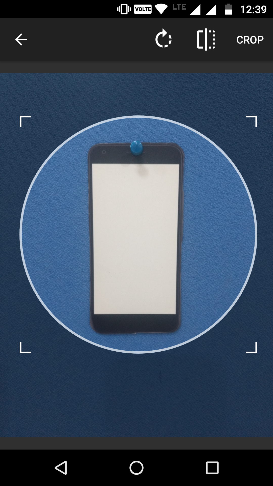
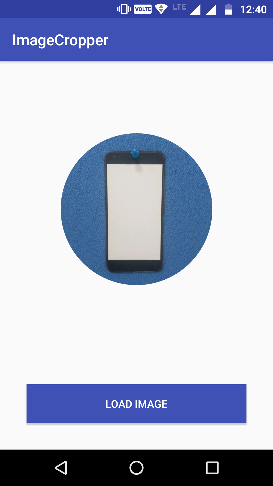

# ImageCropper
An example of Image cropping app in which image can be cropped in different shapes. 
Library Used: https://github.com/ArthurHub/Android-Image-Cropper

 &nbsp; &nbsp; &nbsp;  &nbsp; &nbsp;

 &nbsp; &nbsp; &nbsp;  &nbsp; &nbsp;
